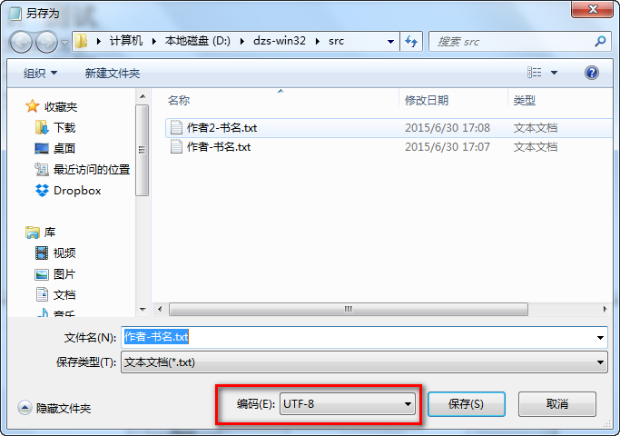
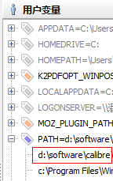

# dzs: txt to ebook  电子书转换

txt 转 电子书 ，自动生成章节目录，调用[calibre](http://www.calibre-ebook.com/)的[ebook-convert](http://manual.calibre-ebook.com/cli/ebook-convert.html#ebook-convert)工具生成电子书。

支持转换的目标类型有 md、mobi、epub、pdf 等等，详细列表见:[ebook-convert-help](http://manual.calibre-ebook.com/cli/ebook-convert.html#ebook-convert)

# usage

    r3 dzs.reb [writer] [book] [txt_file] [dst_ebook_type]
    r3 dzs.reb 飘灯 风尘叹 fct.txt mobi

    r3 dzs.reb [writer-book.txt] [dst_ebook_type]
    r3 dzs.reb \"作者-书名.txt\" mobi

# example

示例文件在[data/](data/)目录下

txt文件内容为utf-8编码

# windows环境安装说明

将 [r3.exe](http://www.rebol.com/r3/downloads.html) 放在 dzs.reb 相同目录下

在 [calibre](http://www.calibre-ebook.com/) 的安装目录下找到 ebook-convert.exe 所在的子目录，将该子目录加入PATH环境变量。

可以用 [rapidee](http://www.rapidee.com/en/about) 等软件添加环境变量。

双击 sample_txt2ebook.bat 执行电子书转换测试，日志写入dzs.log
