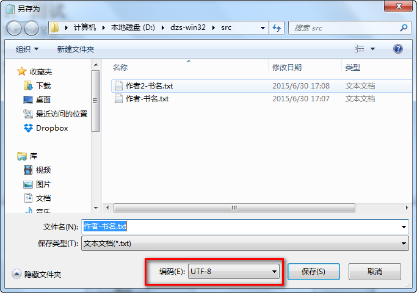
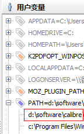

# dzs: txt to ebook  电子书转换

txt to ebook, auto add index, use calibre's ebook-convert tool to generate mobi/epub/pdf...

max chapter number of each ebook is 2000.

txt 转 电子书 ，自动生成章节目录。 多于2000章的txt会自动拆分成多个电子书，每个电子书不超过2000章。

调用[calibre](http://www.calibre-ebook.com/)的ebook-convert工具生成电子书。

支持转换的目标类型有 md、mobi、epub、pdf 等等，详细列表见:[ebook-convert-help](http://manual.calibre-ebook.com/cli/ebook-convert.html#ebook-convert)

# usage 用法

    r3 dzs.reb [writer-book.txt] [dst_ebook_type]
    r3 dzs.reb \"飘灯-风尘叹.txt\" mobi

    r3 dzs.reb [writer] [book] [txt_file] [dst_ebook_type]
    r3 dzs.reb 飘灯 风尘叹 fct.txt mobi

# txt 文件要求

example in [data/](data/) directory, 示例文件在[data/](data/)目录下

txt file charset : utf-8

txt文件内容为utf-8编码

# install 安装

[rebol](http://www.rebol.com/r3/downloads.html)

[calibre](http://www.calibre-ebook.com/)

windows : add calibre directory to PATH env, 把calibre的安装目录加入PATH环境变量，可以用 [rapidee](http://www.rapidee.com/en/about) 等软件添加环境变量

